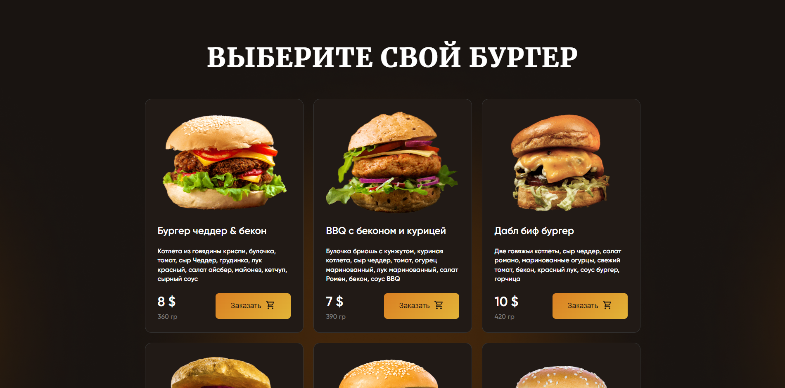

# Burgers Website

This repository contains the code for the Burgers website.

## About

The Burgers website is a platform for showcasing different types of burgers offered by a restaurant. It provides information about the restaurant, its menu, contact details, and more.

## Features

- **Responsive Design:** The website is designed to be responsive, ensuring a seamless experience across different devices.
- **Menu Display:** Users can explore the menu to view different types of burgers offered by the restaurant.
- **Contact Information:** Contact details such as address, phone number, and email are provided for users to reach out to the restaurant.
- **Location Map:** A map is included to help users locate the restaurant easily.

## Technologies Used

- HTML
- CSS
- JavaScript
- Bootstrap

## Getting Started

To get a local copy up and running follow these simple steps:

1. Clone the repository:
   ```sh
   git clone https://github.com/Saaayurii/burgers-Angular-.git
2. Navigate into the project directory:
   cd burgers
3. Open the index.html file in your web browser.

## Screenshots





 
